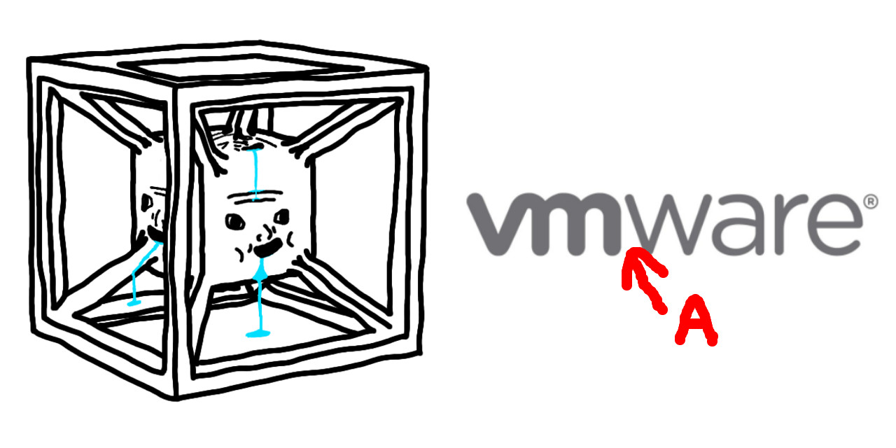
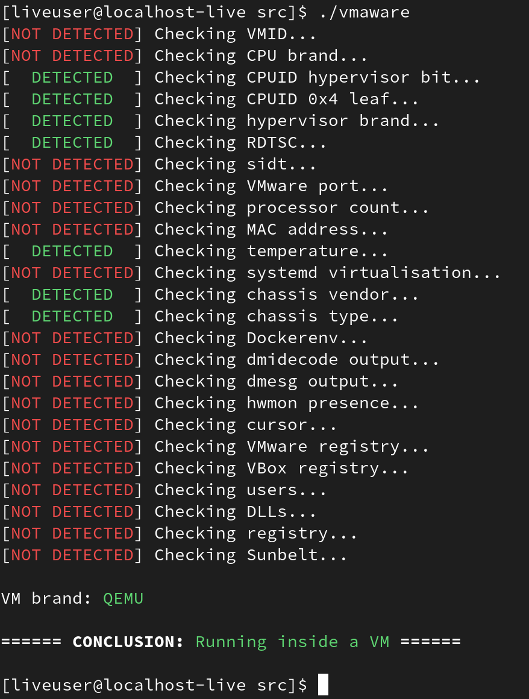

<h1 align="center">VMAware</h1>
<br>
<p align="center">

<br>


</p>

**VMAware** (not to be confused with VMware) is an open-source, cross-platform, and incredibly simple C++ library for virtual machine detection.


It utilises a comprehensive list of low-level and high-level anti-VM techniques that gets accounted in a scoring system. The library is meant to be stupidly easy to use, and 


The library is:
- Very easy to use, with only 3 functions in its public interface
- Very flexible with fine-grained control
- Cross-platform (to an extent)
- Header-only
- Available with C++11 and above
- Able to detect VMware, VirtualBox, QEMU, KVM, Parallels, and much more!
- Able to detect semi-VM technologies like hypervisors, docker, and wine
- Able to determine the VM brand
- Incredibly fast (takes around 1~5 milliseconds)
- Memoized, meaning past results are cached and retrieved if ran again for performance benefits 

- - -

**IMPORTANT:** The library is currently a beta, so more improvements and cross-compatibility fixes are planned (especially for Windows which I'm currently working on fixing). I don't recommend using this for any serious projects for now.

- - -


# Example 🧪
```cpp
#include "vmaware.hpp"
#include <iostream>

int main() {
    if (VM::detect()) {
        std::cout << "Virtual machine detected!\n";
        std::cout << "VM name: " << VM::brand() << "\n";
    } else {
        std::cout << "Running in baremetal\n";
    }
}
```


# CLI tool 🔧
This project also provides a tiny, but handy CLI tool utilising the full potential of what the library can do.




# Installation 📥
To install the library, simply download or copy and paste the [vmaware.hpp](src/vmaware.hpp) file to your project. No CMake or build frameworks are necessary, it's literally that simple.

However, if you want the full project (globally accessible headers with <vmaware.hpp> and the CLI tool), follow these commands:
```bash
git clone https://github.com/kernelwernel/VMAware 
cd VMAware
mkdir build
cd build
cmake ..
sudo make install
```
> NOTE: I'm most likely going to change my username in the future. If the github link doesn't exist, search for the VMAware project and you should find it.


# Documentation 📒
You can view the full docs [here](docs/documentation.md). Trust me, it's not too intimidating 


# Q&A ❓
- Who is this library for?
> It's designed for anticheat developers, security researchers, VM engineers, and pretty much anybody who needs a practical and rock-solid VM detection mechanism in their project. For example, if you're a gamer developer and you want to prevent exploit developers probing the game in a VM or anybody attempting a ban evasion, this is a suitable project for those use cases.

- Why another VM detection project?
> There's already loads of projects that have the same goal such as [InviZzzible](https://github.com/CheckPointSW/InviZzzible), [pafish](https://github.com/a0rtega/pafish) and [Al-Khaser](https://github.com/LordNoteworthy/al-khaser). But the difference between the aforementioned projects is that they have little to no support with non-Windows systems. On top of this, I wanted the VM detection techniques to be accessible programmatically for everybody to find something useful out of it rather than providing just a CLI tool like the projects above.

- Can I use this for malware?
> This project is not soliciting the development of malware for any malicious purpose. Even if you intend to use it that way, it'll most likely be flagged by antiviruses anyway.

- When will a 1.0 be available?
> Pretty soon, maybe around a week or 2 (I just started university a few days ago, so I can't guarantee anything)


# Issues and pull requests 
If you have any suggestions, ideas, or any sort of contribution, feel free to ask! I'll be more than happy to discuss. If you found this project useful, a star would be appreciated :)


# Credits ✒️
- [Check Point Research](https://research.checkpoint.com/)
- [Unprotect Project](https://unprotect.it/)
- [Al-Khaser](https://github.com/LordNoteworthy/al-khaser)
- [pafish](https://github.com/a0rtega/pafish)
- [Matteo Malvica](https://www.matteomalvica.com)


# Legal 📜
I am not responsible nor liable for any damage you cause through any malicious usage of this project. 

License: GPL-3.0