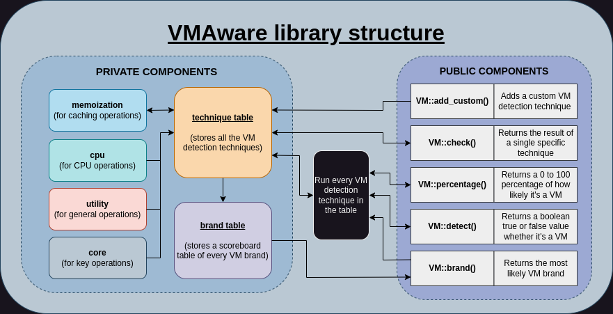

<h1 align="center">VMAware</h1>
<br>
<p align="center">

<br>


</p>

**VMAware** (VM + Aware) is a cross-platform C++ library for virtual machine detection.

The library is:
- Very easy to use, with only 5 functions in its public interface
- Cross-platform (Windows + MacOS + Linux)
- Compatible with ARM architecture and 32-bit Windows
- Features up to 80+ unique VM detection techniques
- Very flexible, with total fine-grained control over which techniques get executed
- Header-only
- Available with C++11 and above
- Able to detect VMware, VirtualBox, QEMU, KVM, Parallels, and [much more](https://github.com/kernelwernel/VMAware/blob/v0.2/docs/documentation.md#vmbrand)
- Able to detect semi-VM technologies like hypervisors, docker, and wine
- Able to guess the VM brand
- Memoized, meaning past results are cached and retrieved if ran again for performance benefits 
- Contains separate MIT and GPL-3.0 compliant library header files

- - -

**IMPORTANT:** 

The library doesn't guarantee it'll be accurate. If you found a false positive or a false negative then please create an issue with information on what your VM is, what OS you're using, and other relevant details.

- - -

<br>

## Example 🧪
```cpp
#include "vmaware.hpp"
#include <iostream>

int main() {
    if (VM::detect()) {
        std::cout << "Virtual machine detected!" << std::endl;
        std::cout << "VM name: " << VM::brand() << std::endl;
    } else {
        std::cout << "Running in baremetal" << std::endl;
    }
    
    std::cout << "VM certainty: " << (int)VM::percentage() << "%" << std::endl;
}
```

<br>

## Structure ⚙️

<p align="center">

<br>
</p>

<br>

## CLI tool 🔧
This project also provides a tiny, but handy CLI tool utilising the full potential of what the library can do. Also, running the CLI as root/admin would give better results.


<br>

## Installation 📥
To install the library, download the `vmaware.hpp` file in the latest [release section](https://github.com/kernelwernel/VMAware/releases/latest) to your project. No CMake or shared object linkages are necessary, it's literally that simple.

However, if you want the full project (globally accessible headers with <vmaware.hpp> and the CLI tool), follow these commands:
```bash
git clone https://github.com/kernelwernel/VMAware 
cd VMAware
```

### FOR LINUX:
```bash
sudo dnf/apt/yum update -y # change this to whatever your distro is
mkdir build
cd build
cmake ..
sudo make install
```

### FOR WINDOWS:
```bash
cmake -S . -B build/ -G "Visual Studio 16 2019"
```

<br>

## Documentation 📒
You can view the full docs [here](docs/documentation.md). Trust me, it's not too intimidating ;)

<br>

## Q&A ❓
- How does it work?
> It utilises a comprehensive list of low-level and high-level anti-VM techniques that gets accounted in a scoring system. The scores (0-100) for each technique are arbitrarily given, and every technique that has detected a VM will have their score added to a single accumulative point, where a threshold point number will decide whether it's actually running in a VM.

- Who is this library for?
> It's designed for security researchers, VM engineers, gamer developers, and pretty much anybody who needs a practical and rock-solid VM detection mechanism in their project. For example, the library is suitable if you're making a VM and you're testing the effectiveness of concealing itself, or if you're a game developer or any proprietary software developer to thwart against reverse engineers, or if you're a malware analyst and you want to check if your VM environment is good enough to avoid detection.

- Why another VM detection project?
> There's already loads of projects that have the same goal such as [InviZzzible](https://github.com/CheckPointSW/InviZzzible), [pafish](https://github.com/a0rtega/pafish) and [Al-Khaser](https://github.com/LordNoteworthy/al-khaser). But the difference between the aforementioned projects is that they don't provide a programmable interface to interact with the detection mechanisms, on top of having little to no support for non-Windows systems. I wanted the core detection techniques to be accessible programmatically in a cross-platform way for everybody to get something useful out of it rather than providing just a CLI tool like those projects.

- Is it possible to spoof the result?
> Yes. There are some techniques that are trivially spoofable, and there's nothing the library can do about it whether it's a deliberate false positive or even a false negative. This is a problem that every VM detection project is facing, which is why the library is trying to test every technique possible to get the best result based on the environment it's running under. 

- What about using this for malware?
> This project is not soliciting the development of malware for obvious reasons. Even if you intend to use it for concealment purposes, it'll most likely be flagged by antiviruses anyway and nothing is obfuscated to begin with. You're not a slick l33t haxxor for abusing the library for malware, and good luck manually obfuscating 6000 lines of C++ code lmfao

- Why GPL 3.0 and MIT? 
> I would've made it strictly MIT so proprietary software can make use of the library, but some of the techniques employed are from GPL 3.0 projects, and I have no choice but to use the same license for legal reasons. This gave me an idea to make an MIT version without all of the GPL code so it can also be used without forcing your code to be open-source. It should be noted that the MIT version removes **10** techniques out of 85 (as of 1.3 version), and the lesser the number of mechanisms, the less accurate the overall result might be.

- The tool has many false positives under a Windows 11 host, why?
> This is because it is in fact running under a VM. More specifically, Hyper-V might be used by default for every program that's running in Windows 11. 

- I have linker errors when compiling with gcc or clang
> Either compile with the `-lm` and `-lstdc++` flags, or use g++/clang++ compilers instead.

<br>

## Issues and pull requests 📬
If you have any suggestions, ideas, or any sort of contribution, feel free to ask! I'll be more than happy to discuss in the [issue](https://github.com/kernelwernel/VMAware/issues) section. If you want to personally ask something in private, my discord is `kr.nl`

And if you found this project useful, a star would be appreciated :)

<br>

## Projects using VMAware
**[CrashLoggerSSE](https://github.com/alandtse/CrashLoggerSSE)** - SKSE/SKSEVR plugin that generates crash logs

**[screenshare-tool](https://github.com/NotRequiem/screenshare-tool)** - Screenshare tool for Windows

**[Some malware I randomly found on MalwareBazaar's database lol](https://bazaar.abuse.ch/browse/tag/vmaware/)**

If you know a project, or if you're working on a project that uses VMAware, let me know and I'll add it here.

<br>


## Credits and contributors ✒️
- [Check Point Research](https://research.checkpoint.com/)
- [Unprotect Project](https://unprotect.it/)
- [Al-Khaser](https://github.com/LordNoteworthy/al-khaser)
- [pafish](https://github.com/a0rtega/pafish)
- [Matteo Malvica](https://www.matteomalvica.com)
- N. Rin, EP_X0FF
- [Peter Ferrie, Symantec](https://github.com/peterferrie)
- [Graham Sutherland, LRQA Nettitude](https://www.nettitude.com/uk/)
- [Requiem](https://github.com/NotRequiem)
- [Alex](https://github.com/greenozon)
- [Marek Knápek](https://github.com/MarekKnapek)
- [Vladyslav Miachkov](https://github.com/fameowner99)
- [(Offensive Security) Danny Quist](chamuco@gmail.com)
- [(Offensive Security) Val Smith](mvalsmith@metasploit.com)
- Tom Liston + Ed Skoudis
- [Tobias Klein](https://www.trapkit.de/index.html)
- [(S21sec) Alfredo Omella](https://www.s21sec.com/)
- [hfiref0x](https://github.com/hfiref0x)
- [Waleedassar](http://waleedassar.blogspot.com)

<br>

## Legal 📜
I am not responsible nor liable for any damage you cause through any malicious usage of this project. 

License: GPL-3.0
