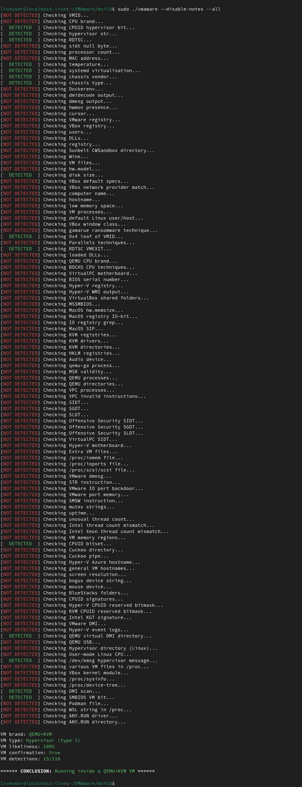

<p align="center">

<br>


</p>

**VMAware** (VM + Aware) is a cross-platform C++ library for virtual machine detection.

- - -

The library is:
- Very easy to use
- Cross-platform (Windows + MacOS + Linux)
- Features up to 100+ unique VM detection techniques [[list](https://github.com/kernelwernel/VMAware/blob/main/docs/documentation.md#flag-table)]
- Able to detect 50+ VM brands including VMware, VirtualBox, QEMU, Hyper-V, and much more [[list](https://github.com/kernelwernel/VMAware/blob/main/docs/documentation.md#brand-table)]
- Compatible with x86 and ARM, with backwards compatibility for 32-bit systems
- Very flexible, with total fine-grained control over which techniques get executed
- Able to detect various VM and semi-VM technologies like hypervisors, emulators, containers, sandboxes, and so on
- Available with C++11 and above
- Header-only
- Memoized, meaning past results are cached and retrieved if ran again for performance benefits 
- Contains separate MIT and GPL-3.0 compliant library header files


<br>


## Example 🧪
```cpp
#include "vmaware.hpp"
#include <iostream>

int main() {
    if (VM::detect()) {
        std::cout << "Virtual machine detected!" << "\n";
    } else {
        std::cout << "Running on baremetal" << "\n";
    }

    std::cout << "VM name: " << VM::brand() << "\n";
    std::cout << "VM type: " << VM::type() << "\n";
    std::cout << "VM certainty: " << (int)VM::percentage() << "%" << "\n";
}
```

possible output:
```
Virtual machine detected!
VM name: VirtualBox
VM type: Hypervisor (type 2)
VM certainty: 100%
```

<br>

## Structure ⚙️

<p align="center">

<br>
</p>

<br>

## CLI tool 🔧
This project also provides a tiny, but handy CLI tool utilising the full potential of what the library can do. It'll give you all sorts of details about the environment it's running under.



<br>

## Installation 📥
To install the library, download the `vmaware.hpp` file in the latest [release section](https://github.com/kernelwernel/VMAware/releases/latest) to your project. The binaries are also located there. No CMake or shared object linkages are necessary, it's literally that simple.

However, if you want the full project (globally accessible headers with <vmaware.hpp> and the CLI tool), follow these commands:
```bash
git clone https://github.com/kernelwernel/VMAware 
cd VMAware
```

<br>

### FOR LINUX:
```bash
sudo dnf/apt/yum update -y # change this to whatever your distro is
mkdir build
cd build
cmake ..
sudo make install
```

### FOR WINDOWS:
```bash
cmake -S . -B build/ -G "Visual Studio 16 2019"
```

### CMake installation
```cmake
# edit this
set(DIRECTORY "/path/to/your/directory/")

# if you want the MIT version, toggle this to ON
option(MIT "MIT version" OFF)

if (MIT)
    set(EXTENSION "_MIT")
else()
    set(EXTENSION "")
endif()

set(DESTINATION "${DIRECTORY}vmaware${EXTENSION}.hpp")

if (NOT EXISTS ${DESTINATION})
    message(STATUS "Downloading VMAware")
    set(URL "https://github.com/kernelwernel/VMAware/releases/latest/download/vmaware${EXTENSION}.hpp")
    file(DOWNLOAD ${URL} ${DESTINATION} SHOW_PROGRESS)
else()
    message(STATUS "VMAware already downloaded, skipping")
endif()
```


<br>

## Documentation 📒
You can view the full docs [here](docs/documentation.md). All the details such as functions, techniques, settings and examples are provided. Trust me, it's not too intimidating ;)

<br>

## Q&A ❓

<details>
<summary>How does it work?</summary>
<br>

> It utilises a comprehensive list of low-level (CPU, GPU, HDD, and firmware) and high-level anti-VM techniques that gets accounted in a scoring system. The scores (0-100) for each technique are arbitrarily given, and every technique that has detected a VM will have their score added to a single accumulative point, where a threshold point number will decide whether it's actually running in a VM.

</details>

<details>
<summary>Who is this library for and what are the use cases?</summary>
<br>

> It's designed for security researchers, VM engineers, gamer developers, and pretty much anybody who needs a practical and rock-solid VM detection mechanism in their project. For example, the library is suitable if you're making a VM and you're testing the effectiveness of concealing itself. If you're a game developer/proprietary software developer, the library is useful to thwart against reverse engineers. If you're a malware analyst and you want to check the concealment capability of your VM, this would be the perfect tool to benchmark how well-concealed your VM is against malware. Additionally, software could optimize performance or resource usage based on the detected environment, and some applications might want to restrict usage in VMs to prevent unauthorized distribution or testing.

</details>

<details>
<summary>Why another VM detection project?</summary>
<br>

> There's already loads of projects that have the same goal such as 
<a href="https://github.com/CheckPointSW/InviZzzible">InviZzzible</a>, <a href="https://github.com/a0rtega/pafish">pafish</a> and <a href="https://github.com/LordNoteworthy/al-khaser">Al-Khaser</a>. But the difference between the aforementioned projects is that they don't provide a programmable interface to interact with the detection mechanisms, on top of having little to no support for non-Windows systems. I wanted the core detection techniques to be accessible programmatically in a cross-platform way for everybody to get something useful out of it rather than providing just a CLI tool. It also contains a larger quantity of techniques, so it's basically just a VM detection library and tool on steroids with maximum flexibility.

</details>


<details>
<summary>How does it compare to paid VM detection libraries? Wouldn't it make it inferior for having it open source?</summary>
<br>

> There are a few paid software to protect the licensing of other software against against reverse engineers or software cracking, such as <a href="https://docs.sentinel.thalesgroup.com/home.htm">Thales' Sentinel RMS</a> and <a href="https://vmpsoft.com/">VMProtect</a>. Although these are not meant to ONLY be VM detection libraries, they are limited in their capabilities in different ways. Sentinel RMS' VM detection does not have as many VM brands (not to mention the pricing is only meant for corporations, not individuals), and VMProtect has a <a href="https://cyber.wtf/2023/02/09/defeating-vmprotects-latest-tricks/">very limited number of detection techniques</a>, where some of them don't require a lot of effort to bypass with only a few configurations to the VM (the detection mechanism has also been <a href="https://github.com/jmpoep/vmprotect-3.5.1/blob/d8fcb7c0ffd4fb45a8cfbd770c8b117d7dbe52b5/runtime/loader.cc#L2464">leaked</a>, so there's no benefit of having it closed source now). Speaking of which, the only downside to VMAware is that it's fully open source, which makes the job of bypassers easier compared to having it closed source. However, I'd argue that's a worthy tradeoff by having as many VM detection techniques in an open and interactive way, including having valuable community feedback to make the library more effective and accurate.

</details>


<details>
<summary>How can the library distinguish between Hyper-V artifacts and an actual Hyper-V VM in the system?</summary>
<br>

> Hyper-V has an obscure feature where if it's enabled in the host system, the CPU hardware values makes it look like the whole system is running inside Hyper-V, which isn't true. This makes it a challenge to determine whether the hardware values the library is collecting is either a real Hyper-V VM, or just the artifacts of what Hyper-V has left as a consequence of having it enabled in the host system. The reason why this is a problem is because the library might falsely conclude that your the host system is running in Hyper-V, which is a false positive. This is where the **Hyper-X** mechanism comes into play to distinguish between these two. This was designed by <a href="https://github.com/NotRequiem">Requiem</a>

<p align="center">

<br>
</details>


<details>
<summary>Is it possible to spoof the result?</summary>
<br>

> Yes. There are some techniques that are trivially spoofable, and there's nothing the library can do about it whether it's a deliberate false positive or even a false negative. This is a problem that every VM detection project is facing whether closed or open source, which is why the library is trying to test every technique possible to get the best result based on the environment it's running under. Remember, EVERYTHING is technically spoofable.

</details>

<details>
<summary>What about using this for malware?</summary>
<br>

> This project is not soliciting the development of malware for obvious reasons. Even if you intend to use it for concealment purposes, it'll most likely be flagged by antiviruses anyway and nothing is obfuscated to begin with. Good fucking luck obfuscating 10k+ lines of C++ code lmao.

</details>

<details>
<summary>Why GPL-3.0 and MIT?</summary>
<br>

> I would've made it strictly MIT so proprietary software can make use of the library, but some of the techniques employed are from GPL 3.0 projects, and I have no choice but to use the same license for legal reasons. This gave me an idea to make an MIT version without all of the GPL code so it can also be used without forcing your code to be open-source. It should be noted that the MIT version removes <b>12</b> techniques out of 116 (as of 1.9 version), and the lesser the number of techniques, the less accurate the overall result might be.

</details>

<details>
<summary>I have linker errors when compiling</summary>
<br>

> If you're compiling with gcc or clang, add the <code>-lm</code> and <code>-lstdc++</code> flags, or use g++/clang++ compilers instead. If you're receiving linker errors from a brand new VM environment on Linux, update your system with `sudo apt/dnf/yum update -y` to install the necessary C++ components.

</details>

<br>

## Issues and pull requests 📬
If you have any suggestions, ideas, or any sort of contribution, feel free to ask! I'll be more than happy to discuss in the [issue](https://github.com/kernelwernel/VMAware/issues) section. If you want to personally ask something in private, my discord is `kr.nl`

And if you found this project useful, a star would be appreciated :)

<br>

## Credits and contributors ✒️
- [Check Point Research](https://research.checkpoint.com/)
- [Unprotect Project](https://unprotect.it/)
- [Al-Khaser](https://github.com/LordNoteworthy/al-khaser)
- [pafish](https://github.com/a0rtega/pafish)
- [Matteo Malvica](https://www.matteomalvica.com)
- N. Rin, EP_X0FF
- [Peter Ferrie, Symantec](https://github.com/peterferrie)
- [Graham Sutherland, LRQA Nettitude](https://www.nettitude.com/uk/)
- [Requiem](https://github.com/NotRequiem)
- [Alex](https://github.com/greenozon)
- [Marek Knápek](https://github.com/MarekKnapek)
- [Vladyslav Miachkov](https://github.com/fameowner99)
- [(Offensive Security) Danny Quist](chamuco@gmail.com)
- [(Offensive Security) Val Smith](mvalsmith@metasploit.com)
- Tom Liston + Ed Skoudis
- [Tobias Klein](https://www.trapkit.de/index.html)
- [(S21sec) Alfredo Omella](https://www.s21sec.com/)
- [hfiref0x](https://github.com/hfiref0x)
- [Waleedassar](http://waleedassar.blogspot.com)
- [一半人生](https://github.com/TimelifeCzy)
- [Thomas Roccia (fr0gger)](https://github.com/fr0gger)
- [systemd project](https://github.com/systemd/systemd)
- mrjaxser
- [iMonket](https://github.com/PrimeMonket)
- Eric Parker's discord community 
- [ShellCode33](https://github.com/ShellCode33)
- [Georgii Gennadev (D00Movenok)](https://github.com/D00Movenok)
- [utoshu](https://github.com/utoshu)

<br>

## Legal 📜
I am not responsible nor liable for any damage you cause through any malicious usage of this project. 

License: GPL-3.0/MIT