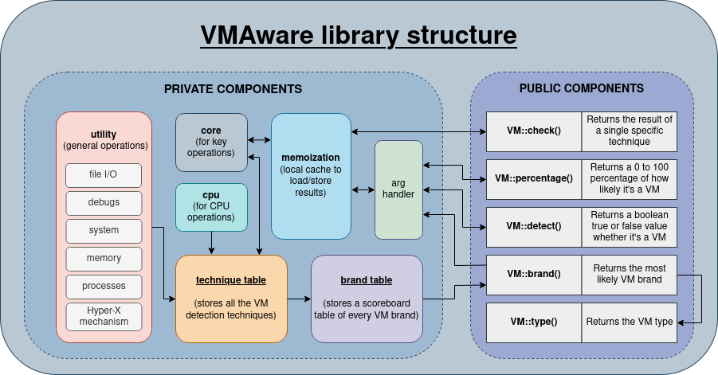
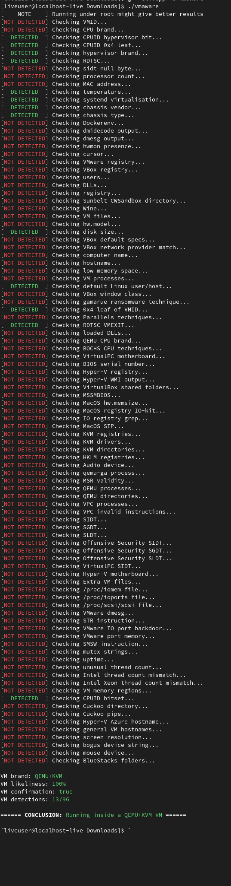

<p align="center">
   
   <br>
   
   
   
   <a href="https://deepwiki.com/kernelwernel/VMAware"></a>
   <a href="https://github.com/kernelwernel/VMAware/actions/workflows/code_ql_analysis.yml">
     
   </a>

   <div align="center">
      <b>VMAware</b> (VM + Aware) 是一个跨平台的C++虚拟机检测库。
      <br>
      <a href="README.md">English 🇬🇧</a> | <a href="README_FR.md">Français 🇫🇷</a>
   </div>
</p>

- - -

这个库:

- 非常易于使用
- 跨平台 (Windows + MacOS + Linux)
- 涵盖约100种独特的虚拟机检测方案 【[列表](https://github.com/kernelwernel/VMAware/blob/main/docs/documentation.md#flag-table)】
- 采用最尖端的技术
- 能够检测超过70种虚拟机品牌，包括 VMware、VirtualBox、QEMU、Hyper-V 等等 【[列表](https://github.com/kernelwernel/VMAware/blob/main/docs/documentation.md#brand-table)】
- 能够击败 VM 硬化技术
- 兼容 x86 和 ARM 架构，并向下兼容 32 位系统
- 非常灵活，可对执行哪些技术进行完全精细化的控制
- 能够检测各种虚拟机和半虚拟机技术，如虚拟机监控程序、模拟器、容器、沙箱等。
- 适用于 C++11 及更高版本
- 纯头文件实现
- 不存在任何外部依赖
- 具备记忆功能：若相同计算再次执行，会从缓存中直接获取过往结果，而非重新计算，从而获得性能提升
- 本项目完全采用MIT许可证授权，允许不受限制地使用、修改和分发

## 例子 🧪

```cpp
#include "vmaware.hpp"
#include <iostream>

int main() {
    if (VM::detect()) {
        std::cout << "Virtual machine detected!" << "\n";
    } else {
        std::cout << "Running on baremetal" << "\n";
    }

    std::cout << "VM name: " << VM::brand() << "\n";
    std::cout << "VM type: " << VM::type() << "\n";
    std::cout << "VM certainty: " << (int)VM::percentage() << "%" << "\n";
    std::cout << "VM hardening: " << (VM::is_hardened() ? "likely" : "not found") << "\n";
}
```

可能的输出：

```plaintext
Virtual machine detected!
VM name: VirtualBox
VM type: Hypervisor (type 2)
VM certainty: 100%
VM hardening: not found
```

## 架构 ⚙️



## 命令行工具 🔧

该项目还提供了一个便捷的命令行工具，充分发挥了库的全部潜力。它还具有跨平台支持。

下面为一个在 Linux 系统上未作任何安全加固的基础QEMU系统的例子



<!-- Try it out on [Compiler Explorer](https://godbolt.org/z/4sKa1sqrW)!-->

## 安装 📥

要安装此库，请从 [最新的发布](https://github.com/kernelwernel/VMAware/releases/latest) 中获取 `vmaware.hpp` 文件并置于您的项目中。预编译二进制文件亦位于该处。无需 CMake 配置或共享库链接，过程极为简便。

然而，若需获取完整项目（即全局可访问的 `vmaware.hpp` 头文件及命令行工具），请使用以下命令：

```bash
git clone https://github.com/kernelwernel/VMAware 
cd VMAware
```

### 对于 Linux

```bash
sudo dnf/apt/yum update -y # change this to whatever your distro is
mkdir build
cd build
cmake ..
sudo make install
```

### 对于 MacOS

```bash
mkdir build
cd build
cmake ..
sudo make install
```

### 对于 Windows

```bash
cmake -S . -B build/ -G "Visual Studio 16 2019"
```

如需启用调试功能，可通过在CMake参数中追加 `-DCMAKE_BUILD_TYPE=Debug` 来创建调试版本。

### CMake 安装

```cmake
# edit this
set(DIRECTORY "/path/to/your/directory/")

set(DESTINATION "${DIRECTORY}vmaware.hpp")

if (NOT EXISTS ${DESTINATION})
    message(STATUS "Downloading VMAware")
    set(URL "https://github.com/kernelwernel/VMAware/releases/latest/download/vmaware.hpp")
    file(DOWNLOAD ${URL} ${DESTINATION} SHOW_PROGRESS)
else()
    message(STATUS "VMAware already downloaded, skipping")
endif()
```

模块文件及函数版本位于 [auxiliary/vmaware_download.cmake](auxiliary/vmaware_download.cmake)

## 文档与代码概述 📒

您可在 [docs/documentation.md](docs/documentation.md) 查看完整文档 。其中详尽列出了所有细节，包括功能、技术、设置及示例。相信我，内容并不复杂

若想了解本库的架构与设计，请访问 [DeepWiki - VMAware](https://deepwiki.com/kernelwernel/VMAware)

## Q&A ❓

<details>
<summary>它是如何运作的？</summary>

> 该库利用一个包含底层与高层技术的全面反VM检测清单，并采用一套评分机制。每种技术（0-100分）的权重均基于旨在最大限度减少误报、专注检测高隐蔽性虚拟机的客观标准。任何成功检测到VM的技术都会将其分数累加至一个汇总点，当该汇总点超过预设阈值时，即触发VM环境判定。

</details>

<details>
<summary>这个库是为谁准备的？有哪些使用场景？</summary>

> 该工具专为安全研究人员、虚拟机工程师、反作弊开发者以及任何需要在项目中部署实用且坚不可摧的虚拟机检测机制的人士设计。该库既能帮助恶意软件分析师测试其虚拟机的隐蔽性，也能助力专有软件开发者保护应用程序免遭逆向工程攻击。它堪称评估虚拟机隐蔽检测能力的有效基准工具。
>
> 此外，软件可根据检测到的环境调整程序行为。这在调试和测试过程中颇具实用价值，同时系统管理员也能灵活管理配置方案。最后，某些应用程序可能需要通过许可证条款在法律层面限制虚拟机使用，以防止未经授权的分发或测试行为。
>
> 还有一些项目采用了我们的工具，例如 [Hypervisor-Phantom](https://codeberg.org/Scrut1ny/Hypervisor-Phantom)，这是一个高级恶意软件分析项目，我们协助其强化了虚拟机监控程序环境并提升了隐蔽性。

</details>

<details>
<summary>为什么要做又一个虚拟机检测项目？</summary>

> 当前已有大量同类项目，例如 [InviZzzible](https://github.com/CheckPointSW/InviZzzible), [pafish](https://github.com/a0rtega/pafish) 和 [Al-Khaser](https://github.com/LordNoteworthy/al-khaser)。 但关键差异在于：这些项目既未提供可编程接口来调用检测机制，又几乎完全不支持非 Windows 系统。更重要的是，它们的虚拟机检测技术往往不够精密，难以应用于实际场景，且支持的检测方案数量有限。另一个关键障碍是这些项目均采用 GPL 协议，导致无法被专有软件项目（这类功能的主要需求方）直接集成使用。
>
> Pafish与InviZzzible项目已停更多年。尽管Al-Khaser仍会偶尔更新，且具备VMAware未覆盖的广泛检测范围（如反调试、反注入等），但由于前文所述的各种局限，其实际效果依然不尽如人意。
>
> 虽然这些项目对 VMAware 的研发有一定借鉴意义，但我们的目标是实现全面超越。核心在于让检测技术能通过编程方式跨平台灵活调用，使所有开发者都能从中获益——而非仅提供命令行工具。此外，本框架还整合了更大量的检测技术，堪称强化版的虚拟机检测框架，专注于为任何场景提供切实可用的解决方案。

</details>

<!--
<details>
<summary>它与付费的虚拟机检测库相比如何？</summary>
<br>

> 当前市面上存在多款用于保护软件许可、防止逆向工程或破解的付费解决方案，例如 [Thales' Sentinel RMS](https://docs.sentinel.thalesgroup.com/home.htm) 和 [VMProtect](https://vmpsoft.com/)。这些工具虽将虚拟机检测纳入其功能集，但其核心焦点并非虚拟机检测技术——这与本项目的专精方向截然不同。

</details>

-->

<details>
<summary>如果项目开源的话，不会让这个项目变差吗？</summary>

> VMAware唯一的缺点在于其完全开源的性质——与闭源相比，这确实会让绕过检测者更容易分析代码。但我们认为这是值得的权衡：通过以开放互动的方式整合大量虚拟机检测技术，远比依赖代码混淆更有价值。开源意味着我们能通过社区讨论、协作开发以及与反反虚拟机项目、恶意软件分析工具的持续对抗，获得宝贵的反馈，从而更高效精准地强化检测库。
>
> 与闭源模式相比，这些优势共同推动着虚拟机检测领域的前沿创新以更高效率发展。这正是本项目能成为当前最佳虚拟机检测框架的原因——由于我们采用了大量其他检测器（无论开源或闭源）未曾使用过的尖端创新技术，要成功绕过它已被证明是极具挑战性的。
>
> 换言之，这代表着在质量与数量、反馈机制以及开放程度上的全面提升，而非依赖混淆技术来实现安全。这正是 OpenSSH、OpenSSL、Linux 内核等安全类开源项目能够保持相对安全性的根本原因——参与改进的贡献者数量远多于怀有恶意探查源代码的尝试者。VMAware秉承这一理念，如果您了解安全领域，必然熟悉这句箴言：“通过混淆实现的安全，根本算不上真正的安全”。

</details>

<details>
<summary>虚拟机加固措施对此库的防护效果如何？</summary>

> 已知的公开强化工具大多已失效，尤其在Windows平台上多数已被攻破，但这并不意味本检测库能完全免疫。那些尚未被披露的定制化强化工具或许具备理论上的优势，但其开发难度也呈数量级增长。

</details>

<details>
<summary>它是如何开发的？</summary>

> 基于线上研究（涵盖从学术论文到私人游戏黑客论坛及Discord社群等渠道），我们持续追踪当前用于隐藏虚拟机的方法，并研究能检测它们的通用方案，以此确保我们始终保持技术领先。
>
> 当我们完成生产级代码开发后，会将其上传至开发分支进行真实环境测试——通过数百乃至数千台设备运行我们的检测算法，并在识别到虚拟机时静默上报，后续由人工核验误报情况。
>
> 若通过实验测试及公开文档/数据库的线上证据确认误报已修正，我们会将变更合并至主分支，并根据新检测技术的有效性、可靠性及与其他技术的协同表现进行综合评分。
>
> 其他特殊情况（如误报标记、编译错误、潜在漏洞等）则立即合并至主分支。
>
> 当库版本累积足够改进后，我们会在发布区详细说明所有变更内容。

</details>

<details>
<summary>那将这个项目用在恶意软件呢？</summary>

> 出于显而易见的原因，本项目不招募恶意软件开发者。即便您打算将其用于隐蔽目的，反病毒软件也极可能将其标记为威胁，况且程序本身并未进行任何混淆处理。
>
> 我们并未刻意开发此库以规避终端检测与响应（EDR）系统的检测标识，例如采用直接/间接系统调用、内联钩子检测等恶意软件逃逸技术。当前实现的所有技术手段均专注于虚拟机检测领域，不涉及任何与恶意规避相关的功能开发。

</details>

<details>
<summary>我在编译时遇到链接错误？</summary>

> 若您在使用 gcc 或 clang 进行编译，请添加 `-lm` 和 `-lstdc++` 编译选项，或直接改用 g++ / clang++ 编译器。若在全新的 Linux 虚拟机环境中遇到链接器报错，请执行 `sudo apt/dnf/yum update -y` 更新系统以安装必要的 C++ 组件。

</details>

## 问题、讨论、拉取请求和咨询 📬

欢迎提出建议、分享想法或参与任何形式的贡献！我们非常乐意在 [Issues](https://github.com/kernelwernel/VMAware/issues) 或 [Discussions](https://github.com/kernelwernel/VMAware/discussions) 板块与您交流。我们通常都会尽快回复。若需私下联系，可通过 Discord 账号 `kr.nl` 或 `shenzken` 联系我们。

邮件咨询请至：`jeanruyv@gmail.com`

如果本项目对您有所帮助，欢迎为我们点亮一颗 Star

## 鸣谢、贡献者及致谢 ✒️

- [kernelwernel](https://github.com/kernelwernel) (Maintainer and developer)
- [Requiem](https://github.com/NotRequiem) (Maintainer and co-developer)
- [Check Point Research](https://research.checkpoint.com/)
- [Unprotect Project](https://unprotect.it/)
- [Al-Khaser](https://github.com/LordNoteworthy/al-khaser)
- [pafish](https://github.com/a0rtega/pafish)
- [Matteo Malvica](https://www.matteomalvica.com)
- N. Rin, EP_X0FF
- [Peter Ferrie, Symantec](https://github.com/peterferrie)
- [Graham Sutherland, LRQA Nettitude](https://www.nettitude.com/uk/)
- [Alex](https://github.com/greenozon)
- [Marek Knápek](https://github.com/MarekKnapek)
- [Vladyslav Miachkov](https://github.com/fameowner99)
- [(Offensive Security) Danny Quist](chamuco@gmail.com)
- [(Offensive Security) Val Smith](mvalsmith@metasploit.com)
- Tom Liston + Ed Skoudis
- [Tobias Klein](https://www.trapkit.de/index.html)
- [(S21sec) Alfredo Omella](https://www.s21sec.com/)
- [hfiref0x](https://github.com/hfiref0x)
- [Waleedassar](http://waleedassar.blogspot.com)
- [一半人生](https://github.com/TimelifeCzy)
- [Thomas Roccia (fr0gger)](https://github.com/fr0gger)
- [systemd project](https://github.com/systemd/systemd)
- mrjaxser
- [iMonket](https://github.com/PrimeMonket)
- Eric Parker's discord community
- [ShellCode33](https://github.com/ShellCode33)
- [Georgii Gennadev (D00Movenok)](https://github.com/D00Movenok)
- [utoshu](https://github.com/utoshu)
- [Jyd](https://github.com/jyd519)
- [git-eternal](https://github.com/git-eternal)
- [dmfrpro](https://github.com/dmfrpro)
- [Teselka](https://github.com/Teselka)
- [Kyun-J](https://github.com/Kyun-J)
- [luukjp](https://github.com/luukjp)
- [Randark](https://github.com/Randark-JMT)

## 法律声明 📜

任何因恶意使用本项目所造成的损害，本人概不负责。

许可证：MIT
