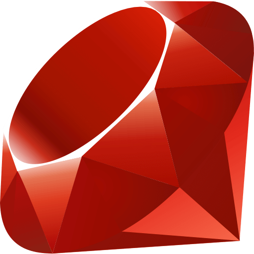

<p align="center">
   
   <br>
   
   
   
   <a href="https://deepwiki.com/kernelwernel/VMAware"></a>
   <a href="https://github.com/kernelwernel/VMAware/actions/workflows/code_ql_analysis.yml">
     
   </a>

   <div align="center">
      <b>VMAware</b> (VM + Aware) est une bibliothèque C++ multiplateforme pour la détection des machines virtuelles.
      <br>
      <br>
      <a href="README.md">English 🇬🇧</a> | <a href="README_CN.md">中文 🇨🇳</a> | <a href="README_KR.md">한국어 🇰🇷</a>
   </div>
</p>

- - -

Cette bibliothèque est :
- Très facile à utiliser
- Multiplateforme (Windows, MacOS et Linux)
- Offre environ 90 techniques uniques pour détecter les machines virtuelles [[liste](https://github.com/kernelwernel/VMAware/blob/main/docs/documentation.md#flag-table)]
- Offre les techniques les plus avancées
- Capable de détecter plus de 70 marques de machines virtuelles, notamment VMware, VirtualBox, QEMU, Hyper-V et bien d'autres [[liste](https://github.com/kernelwernel/VMAware/blob/main/docs/documentation.md#brand-table)]
- Capable de contourner les renforts des VM
- Support multi-architecture (amd64, arm64, armhf, armel, i386, mips64el, ppc64el, riscv64, s390x)
- Très flexible, avec un contrôle précis sur les techniques exécutées
- Capable de détecter diverses technologies VM et semi-VM telles que les hyperviseurs, les émulateurs, les conteneurs, les sandbox, etc.
- Disponible avec C++11 et versions ultérieures
- header-only
- Sans aucune dépendance externe
- Mémoïsé, ce qui signifie que les résultats passés sont mis en cache et récupérés en cas de nouvelle exécution pour améliorer les performances
- Entièrement sous licence MIT, permettant une utilisation et une distribution sans restriction

<br>

> [!NOTE]
> Nous recherchons des traducteurs prêts à traduire ce README dans leur langue maternelle. Si vous souhaitez contribuer, n'hésitez pas à soumettre une PR !


## Exemple 🧪
```cpp
#include "vmaware.hpp"
#include <iostream>

int main() {
    if (VM::detect()) {
        std::cout << "Virtual machine detected!" << "\n";
    } else {
        std::cout << "Running on baremetal" << "\n";
    }

    std::cout << "VM name: " << VM::brand() << "\n";
    std::cout << "VM type: " << VM::type() << "\n";
    std::cout << "VM certainty: " << (int)VM::percentage() << "%" << "\n";
    std::cout << "VM hardening: " << (VM::is_hardened() ? "likely" : "not found") << "\n";
}
```

résultat possible:
```
Virtual machine detected!
VM name: VirtualBox
VM type: Hypervisor (type 2)
VM certainty: 100%
VM hardening: not found
```

<br>

## Structure ⚙️

<p align="center">

<br>
</p>

<br>

## Outil CLI 🔧
Ce projet fournit également un outil CLI pratique qui exploite tout le potentiel de la bibliothèque. Il offre également une prise en charge multiplateforme.

Vous trouverez ci-dessous un exemple de système QEMU de base sans modifications de renforcement sofiles Linux.


<!-- Try it out on [Compiler Explorer](https://godbolt.org/z/4sKa1sqrW)!-->

<br>

## Installation 📥
Pour installer la bibliothèque, téléchargez le fichier `vmaware.hpp` dans la dernière [section de publication](https://github.com/kernelwernel/VMAware/releases/latest) vers votre projet. Les binaires s'y trouvent également. Aucun CMake ni les liens des shared objects sont nécessaire, c'est aussi simple que ça.

Toutefois, si vous souhaitez obtenir le projet complet (ficher header accessibles globalement avec <vmaware.hpp> et l'outil CLI), suivez ces commandes:
```bash
git clone https://github.com/kernelwernel/VMAware 
cd VMAware
```

### FOR LINUX:
```bash
sudo dnf/apt/yum update -y # modifiez ceci en fonction de votre distribution.
mkdir build
cd build
cmake ..
sudo make install
```

### FOR MACOS:
```bash
mkdir build
cd build
cmake ..
sudo make install
```

### FOR WINDOWS:
```bash
cmake -S . -B build/ -G "Visual Studio 16 2019"
```

Vous pouvez également créer une version de débogage en ajoutant `-DCMAKE_BUILD_TYPE=Debug` aux arguments cmake.

<br>

### Installation avec CMake
```cmake
# changer ceci
set(DIRECTORY "/path/to/your/directory/")

set(DESTINATION "${DIRECTORY}vmaware.hpp")

if (NOT EXISTS ${DESTINATION})
    message(STATUS "Downloading VMAware")
    set(URL "https://github.com/kernelwernel/VMAware/releases/latest/download/vmaware.hpp")
    file(DOWNLOAD ${URL} ${DESTINATION} SHOW_PROGRESS)
else()
    message(STATUS "VMAware already downloaded, skipping")
endif()
```

Le fichier du module et la version fonctionelle se trouvent [ici](auxiliary/vmaware_download.cmake)

<br>

## Documentation et aperçu du code 📒
Vous pouvez consulter la documentation complète [ici](docs/documentation.md). Vous y trouverez tous les détails comme les: fonctions, techniques, paramètres et des exemples. Croyez-moi, ce n’est pas si compliqué ;)

Si vous voulez comprendre l’architecture et la conception de la bibliothèque, rendez-vous sur https://deepwiki.com/kernelwernel/VMAware

<br>


## Portages vers d’autres langages 🔀

VMAware prend également en charge une variété de langages. Si C++ n’est pas le langage que vous recherchez, veuillez vous référer à la liste ci-dessous. Tous ces projets sont officiellement référencés par les développeurs de VMAware.

| Langage | Dépôt | Détails | Auteur |
|:---------|:---------------:|:--------:|:------:|
|  Ruby | [lien](https://github.com/kernelwernel/VMAware/tree/main/gem) | Portage Ruby officiel intégré dans le dépôt VMAware, mais Windows n’est pas pris en charge. | [Adam Ruman](https://github.com/addam128) |
|  JS | [lien](https://github.com/Kyun-J/node-vm-detect) | Très bonne API, activement maintenu. | [Kyun-J](https://github.com/Kyun-J) |

> [!WARNING]
> Bien que des portages non officiels existent, ceux-ci ne sont pas aussi testés et validés que nos portages officiels. De plus, tous les portages sont susceptibles de générer des faux positifs en raison de la complexité du code C++ dont ils sont issus. En dehors de cette liste, les portages utilisant l’IA sont incapables de reproduire nos techniques avec précision (ou pire, échouent complètement). Utilisez-les à vos propres risques.

<br>

## Questions et réponses ❓

<details>
<summary>Comment ça marche?</summary>
<br>

> Ce système utilise une liste exhaustive de techniques anti-VM de bas et de haut niveau, prises en compte dans un système de notation. Les scores (de 0 à 100) attribués à chaque technique sont basés sur des critères objectifs visant à détecter les VM les plus furtives en minimisant les faux positifs. Le score de chaque technique ayant détecté une VM est ajouté à un total cumulatif. Un seuil de points détermine si la technique est effectivement exécutée dans une VM.

</details>

<details>
<summary>À qui s'adresse cette bibliothèque et quels sont ses cas d'utilisation?</summary>
<br>

> C'est conçue pour les chercheurs en sécurité, les ingénieurs des VM, les développeurs de solutions anti-triche et, plus généralement, toute personne ayant besoin d'un mécanisme de détection de machines virtuelles fiable et performant. Cette bibliothèque est utile aux analystes des malwares testant la dissimulation de leurs VM et aux développeurs de logiciels propriétaires souhaitant protéger leurs applications contre les reverse engineers. Elle constitue un outil efficace pour évaluer la capacité d'une VM à se dissimuler.
> 
> De plus, les logiciels pourraient adapter leur comportement en fonction de l'environnement détecté. Cela pourrait s'avérer utile pour le débogage et les tests, tandis que les administrateurs système pourraient gérer les configurations différemment. Enfin, certaines applications pourraient souhaiter restreindre légalement leur utilisation dans les VM, par exemple via une clause de licence, afin d'empêcher toute distribution ou tout test non autorisé.
>
> Il existe également des projets qui utilisent notre outil tels que [Hypervisor-Phantom](https://codeberg.org/Scrut1ny/Hypervisor-Phantom), qui est un projet d'analyse de logiciels malveillants avancé que nous avons aidé à renforcer leur environnement hyperviseur et leur indétectabilité.

</details>

<details>
<summary>Pourquoi un autre projet de détection des VM?</summary>
<br>

> De nombreux projets poursuivent déjà le même objectif, tels que :
<a href="https://github.com/CheckPointSW/InviZzzible">InviZzzible</a>, <a href="https://github.com/a0rtega/pafish">pafish</a> et <a href="https://github.com/LordNoteworthy/al-khaser">Al-Khaser</a>. Cependant, ces projets se distinguent par l’absence d’interface programmable permettant d’interagir avec leurs mécanismes de détection, ainsi que par une prise en charge très limitée, et du support inexistant des systèmes non-Windows. De plus, leurs systèmes de détection des VM sont souvent trop simplistes pour une application concrète, et ils ne proposent pas suffisamment de techniques de détection. Un obstacle supplémentaire réside dans le fait qu'il s'agit de projets sous licence GPL. Donc, l'utilisation pour des projets propriétaires (qui constitueraient le principal public cible de cette fonctionnalité) est exclue.
>
> Pafish et InviZzzible sont abandonnés depuis des années. Bien qu'Al-Khaser bénéficie des mises à jour occasionnelles et offre un large éventail de détections que VMAware n'offre pas (anti-debugging, anti-injection, etc.), il reste inefficace en raison des problèmes mentionnés précédemment.
> 
> Bien que ces projets aient été utiles à VMAware dans une certaine mesure, nous souhaitions les améliorer considérablement. Notre objectif était de rendre les techniques de détection accessibles par programmation, de manière multiplateforme et flexible, afin que chacun puisse en tirer profit, plutôt que de fournir un simple outil en ligne de commande. Al-Khaser intègre également un plus grand nombre de techniques ; il s'agit donc essentiellement d'un framework de détection des VM ultra-performant, axé sur une utilisation pratique et réaliste dans tous les scénarios.

</details>

<details>
<summary>Le fait que le projet soit open source ne le désavantage-t-il pas?</summary>
<br>

> Le seul inconvénient de VMAware est qu'il est entièrement open source, ce qui facilite la tâche des pirates par rapport à un logiciel propriétaire. Nous estimons toutefois que ce compromis est justifié par la mise à disposition d'un maximum de techniques de détection des VM de manière ouverte et interactive, plutôt que par la dissimulation. Le fait que le logiciel soit open source nous permet de bénéficier des précieux retours de la communauté afin d'améliorer la bibliothèque de manière plus efficace et précise grâce aux discussions, aux collaborations et à la concurrence avec les projets anti-anti-VM et les outils d'analyse de malware qui tentent de masquer la nature virtuelle d'un logiciel.
> 
> Tout cela a permis de faire progresser les innovations de pointe dans le domaine de la détection des VM de manière beaucoup plus productive qu'avec un logiciel propriétaire. C'est ce qui a fait de notre projet le meilleur framework de détection de VM qui existe, et le contourner s'avère extrêmement difficile en raison du nombre considérable de techniques sophistiquées et inédites que nous utilisons et que les autres détecteurs des VM, qu'ils soient open source ou propriétaires (à notre connaissance), n'emploient pas.
> 
> En d'autres termes, nous privilégions la qualité ET la quantité, les retours d'information et la transparence à la sécurité par l'obfuscation. C'est la même raison pour laquelle OpenSSH, OpenSSL, le kernel Linux et d'autres logiciels de sécurité sont relativement sécurisés: leur amélioration est favorisée par une communauté plus nombreuse que les tentatives malveillantes d'analyser le code source. VMAware partage cette philosophie, et si vous vous intéressez à la sécurité, vous connaissez sans doute l'adage: «La sécurité par l'obfuscation n'est PAS la sécurité.»

</details>


<details>
<summary>Quelle est l'efficacité des outils de renforcement de la sécurité des VM contre la bibliothèque?</summary>

> Les outils de renforcement connus du public sont inefficaces et la plupart de ceux utilisés sous Windows ont été contournés. Cependant, cela ne signifie pas que la bibliothèque y est immunisée. Des outils personnalisés, parfois inconnus, pourraient présenter un avantage théorique, mais leur développement est bien plus complexe.

</details>


<details>
<summary>Comment est-il développé?</summary>
<br>

> À partir de recherches en ligne (articles scientifiques, forums privés de piratage de jeux, serveurs Discord, etc.), nous identifions les méthodes utilisées pour dissimuler les VM et étudions des techniques de détection générales capables de les repérer, tout en surveillant en permanence leur activité pour garder une longueur d'avance.
> 
> Une fois le code prêt pour la production, nous le téléversons directement sur la branche main et commençons les tests en conditions réelles. 
> 
> Les produits intégrant notre bibliothèque exécutent nos algorithmes de détection sur des centaines voire des milliers d'appareils et nous signalent discrètement toute détection de VM ; ces signalements sont ensuite vérifiés manuellement pour détecter d'éventuels faux positifs.
> 
> Si les tests expérimentaux et les preuves issues de la documentation et des bases de données publiques confirment que les faux positifs ont été corrigés, nous conservons les modifications sur main et attribuons un score aux nouvelles détections selon leur efficacité, leur fiabilité et leur interaction avec les autres techniques.
> 
> D'autres situations (faux positifs, erreurs de compilation, vulnérabilités potentielles, etc.) sont également intégrées immédiatement sur main.
> 
> Quand la bibliothèque a accumulé suffisamment de modifications par rapport aux versions précédentes, nous publions une release et détaillons les changements dans les notes de version.

</details>

<details>
<summary>Qu'en est-il de son utilisation pour des logiciels malveillants?</summary>
<br>

> Ce projet n'encourage pas le développement de logiciels malveillants (ou malware), pour des raisons évidentes. Même si vous envisagez de l'utiliser à des fins de dissimulation, il sera très probablement détecté par les antivirus de toute façon, et rien n'est obfusqué au départ.
>
> Nous ne développons pas intentionnellement cette bibliothèque dans le but de bloquer ou de contourner les indicateurs EDR, tels que l'utilisation des syscall directs/indirects, la détection d'interception en ligne et toute autre technique d'évasion de logiciels malveillants non liée à la détection par hyperviseur.

</details>

<details>
<summary>J'ai des erreurs du linkeur lors de la compilation</summary>
<br>

> Si vous compilez avec gcc ou clang, ajoutez les options <code>-lm</code> et <code>-lstdc++</code>, ou utilisez plutôt les compilateurs g++/clang++. Si vous rencontrez des erreurs de l'éditeur de liens depuis un environnement de VM Linux flambant neuf, mettez à jour votre système avec `sudo apt/dnf/yum update -y` pour installer les composants C++ nécessaires.

</details>

<br>

## Problèmes, discussions, demandes de tirage (pull requests) et questions 📬
N'hésitez pas à nous faire part de vos suggestions, idées ou contributions! Nous serons ravis d'en discuter dans les sections [issues](https://github.com/kernelwernel/VMAware/issues) ou [discussions](https://github.com/kernelwernel/VMAware/discussions). Nous répondons généralement assez rapidement. Si vous souhaitez nous poser une question en privé, vous pouvez nous contacter sur Discord: `kr.nl` et `shenzken`.

Pour toute question par e-mail: `jeanruyv@gmail.com`

Et si ce projet vous a été utile, un star serait très apprécié :)

<br>

## Crédits, contributeurs et remerciements ✒️

<a href="https://github.com/kernelwernel/VMAware/graphs/contributors">
  
</a>

<br>

- [kernelwernel](https://github.com/kernelwernel) (Maintainer and developer)
- [Requiem](https://github.com/NotRequiem) (Maintainer and co-developer)
- [Check Point Research](https://research.checkpoint.com/)
- [Unprotect Project](https://unprotect.it/)
- [Al-Khaser](https://github.com/LordNoteworthy/al-khaser)
- [pafish](https://github.com/a0rtega/pafish)
- [Matteo Malvica](https://www.matteomalvica.com)
- N. Rin, EP_X0FF
- [Peter Ferrie, Symantec](https://github.com/peterferrie)
- [Graham Sutherland, LRQA Nettitude](https://www.nettitude.com/uk/)
- [Alex](https://github.com/greenozon)
- [Marek Knápek](https://github.com/MarekKnapek)
- [Vladyslav Miachkov](https://github.com/fameowner99)
- [(Offensive Security) Danny Quist](chamuco@gmail.com)
- [(Offensive Security) Val Smith](mvalsmith@metasploit.com)
- Tom Liston + Ed Skoudis
- [Tobias Klein](https://www.trapkit.de/index.html)
- [(S21sec) Alfredo Omella](https://www.s21sec.com/)
- [hfiref0x](https://github.com/hfiref0x)
- [Waleedassar](http://waleedassar.blogspot.com)
- [一半人生](https://github.com/TimelifeCzy)
- [Thomas Roccia (fr0gger)](https://github.com/fr0gger)
- [systemd project](https://github.com/systemd/systemd)
- mrjaxser
- [iMonket](https://github.com/PrimeMonket)
- Eric Parker's discord community 
- [ShellCode33](https://github.com/ShellCode33)
- [Georgii Gennadev (D00Movenok)](https://github.com/D00Movenok)
- [utoshu](https://github.com/utoshu)
- [Jyd](https://github.com/jyd519)
- [git-eternal](https://github.com/git-eternal)
- [dmfrpro](https://github.com/dmfrpro)
- [Teselka](https://github.com/Teselka)
- [Kyun-J](https://github.com/Kyun-J)
- [luukjp](https://github.com/luukjp)
- [Randark](https://github.com/Randark-JMT)
- [Scrut1ny](https://github.com/Scrut1ny)
- [Lorenzo Rizzotti (Dreaming-Codes)](https://github.com/Dreaming-Codes)
- [virtfunc](https://github.com/virtfunc)
- [Adam Ruman](https://github.com/addam128)

<br>


## Mentions légales 📜
Je décline toute responsabilité en cas de dommages causés par une utilisation malveillante de ce projet.

Licence : MIT