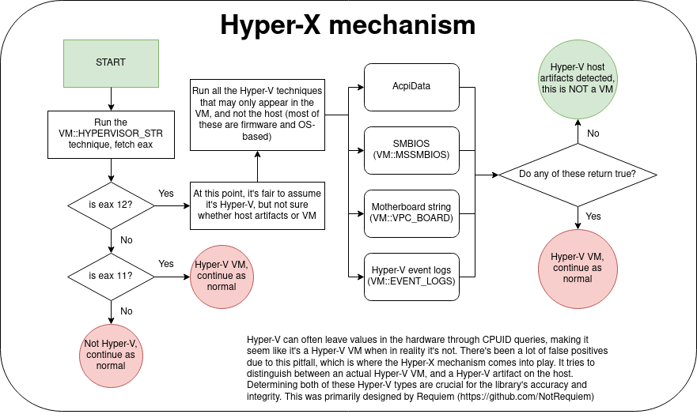

- completely fixed all false positives due to Hyper-V artifacts with new "Hyper-X" mechanism designed by @NotRequiem

 

 
 

- added 2 new VM brands: 
    - `Hyper-V artifacts (not an actual VM)`
    - `User-mode Linux`
- added 7 new techniques:
    - `VM::QEMU_VIRTUAL_DMI`
    - `VM::QEMU_USB`
    - `VM::HYPERVISOR_DIR`
    - `VM::UML_CPU`
    - `VM::KMSG`
    - `VM::XEN_PROC`
    - `VM::VBOX_MODULE`